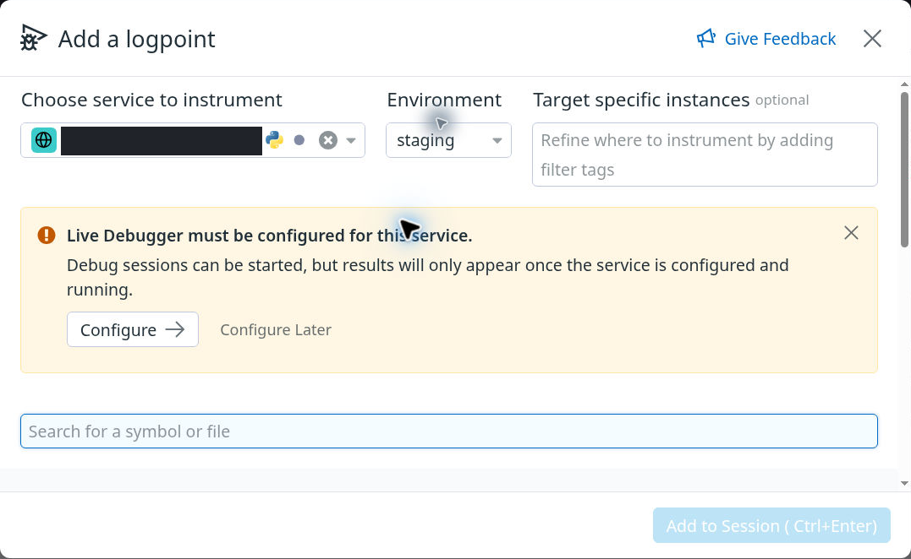
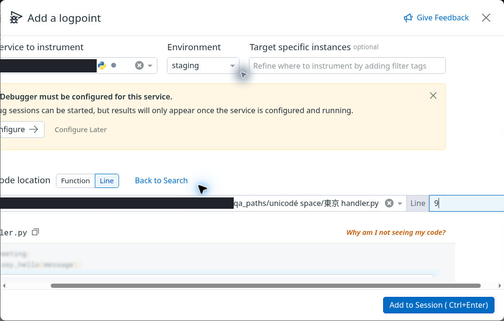
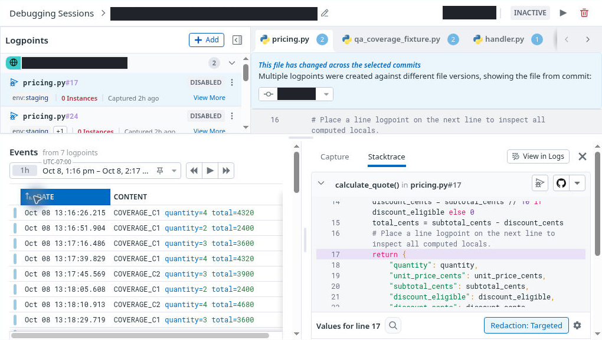
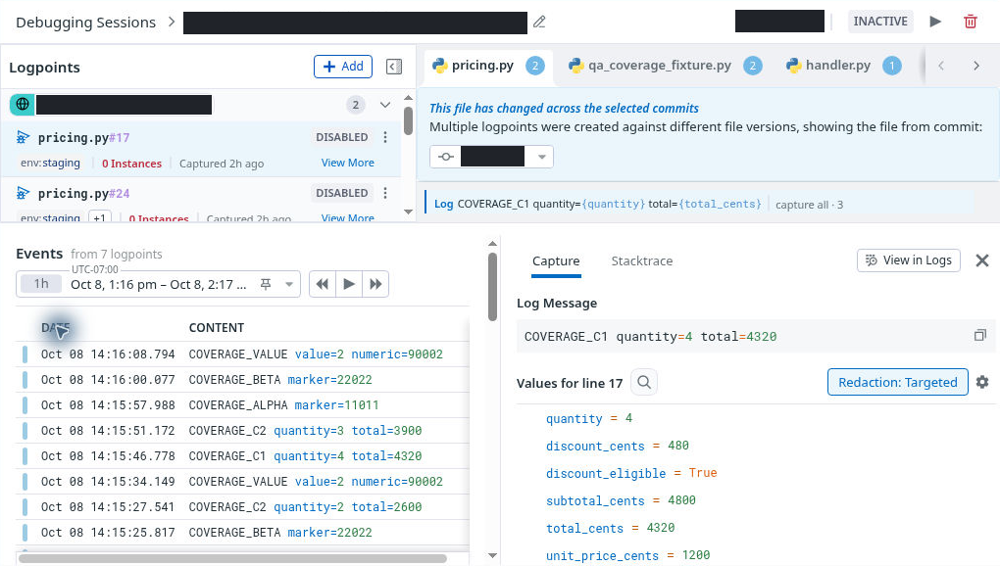

# UI-only follow-up: zoom, draft entry and retained sorting

**Observed 8 October 2026, 23:15:22–23:38:38 UTC.** This dated addendum follows the [frozen V12 report](report.pdf). It adds evidence without changing the 37-page PDF/Word, the original 63-case verdicts, or the ten findings. The V12 inventory remains 23 PASS, 8 FINDING, 19 IN_PROGRESS, 2 PENDING and 11 BLOCKED; severity remains 0 High, 4 Medium and 6 Low.

No logpoint was created or reactivated, and no runtime was dispatched. All drafts were discarded, browser zoom returned to 100%, and the final unfiltered inventory at 23:38:38 UTC showed **All 7 / Active 0 / Inactive 7**.

## What the additional checks establish

| Original case | Additional evidence | Remaining scope |
|---|---|---|
| B09: keyboard, zoom and labels | Native browser popups verified 150% and 125% zoom; the modal action footer stayed visible. Initial search autofocus, reverse-Tab traversal, visible focus rings, keyboard service selection and Escape/focus return were observed. A long synthetic Unicode path wrapped in search and was accepted as a manual File value; Line 9 was entered by keyboard. Exact role lookup found one textbox named **Enter line number**. | This is bounded browser interaction evidence, not a screen-reader run or global accessibility assessment. The recorded role lookup supplies a meaningful observed name despite absent explicit label/ARIA attributes; the field should not be called unlabeled on that evidence. The code-gutter and broader navigation branches remain incomplete. |
| F15: alternate-target draft | Changing to an alternate service cleared Environment. The Environment selector for the alternate service showed “No environments found” when searched for staging; the cause of that absence was not established. Returning to the original inherited staging scope allowed a manual path/line draft. Cancel retained the original C1 capture/source and seven-logpoint count. | No alternate entity was created. This advances the draft/dependency branch but does not establish retargeting after a saved alternate creation or full historical-event isolation. |
| F17: retained sort state | Explicit descending and ascending indicators were recorded. The separately checked, settled ascending receipt showed eight chronological visible rows. Refresh cleared the ascending indicator/aria-sort and restored descending order in the sampled visible rows; the selected snapshot identity survived. | Sort-choice persistence remains an unverified contract. This repeats the reset without establishing a stale ascending indicator, a new finding or a full-case PASS. The immediate post-click receipt is transitional and is not used as the settled outcome. |

## Keyboard observation still under review

In the recorded symbol-search attempts, Tab closed the visible manual-entry fallback and moved focus to Clear search query, then Give Feedback. Down/Up plus Enter retained textbox focus without an active descendant and did not open the manual fields. An earlier pointer activation worked; a later pointer repeat was affected by popup timing/no-match state. These limited attempts do **not** establish that the manual fallback is universally inaccessible by keyboard.

Tab inserted spaces in the unsaved Monaco message editor. That observed editing behavior alone is not a keyboard-trap finding. A native Alt+F1 attempt hit a desktop shortcut/D-Bus conflict, and browser-dispatched Alt+F1 did not expose help; the environment/tool limitation is not scored as a product defect. At 125%, the long File value produced inner horizontal scrolling while line focus and the fixed action footer remained visible.

## Genuine evidence and recording scope

[Eight safe stills, captions and provenance](evidence/ui-only-followup/manifest.json) · [Safe outcome summary](evidence/ui-only-followup/evidence-summary.json) · [Source 18 archive and omissions](recordings/continuation-18/CONTINUATION_RECORDING_ARCHIVE.md) · [Edited highlights and chapters](recordings/continuation-18/highlights/CONTINUATION_HIGHLIGHTS.md).

The native zoom popup is outside this crop and is corroborated separately in the recording. [Exact image scope](evidence/ui-only-followup/01-caption.txt).

This is an unsubmitted draft. The name lookup comes from a separate recorded role inspection. [Exact image scope](evidence/ui-only-followup/04-caption.txt).

The event-row clocks are historical UI times, not the follow-up's execution or screenshot-acquisition clocks. [Ascending scope](evidence/ui-only-followup/06-caption.txt) · [Refresh scope](evidence/ui-only-followup/07-caption.txt) · [Final unfiltered 7 / 0 / 7 inventory](evidence/ui-only-followup/08-final-unfiltered-inventory-7-0-7-safe.png).

Captions distinguish visible pixels from separately recorded focus, role/name and identity observations. All unmasked still pixels are preserved from their source crops. No screenshot is inserted to imitate motion, and no missing interaction is reconstructed.

Source 18 retains 22:55.85 of its 23:16.00 recording, with 00:20.15 of setup/privacy transitions omitted and a separate 03:35.40 highlight edit. Seventeen short source timestamp gaps (maximum 0.30 seconds) are represented by disclosed held frames at original elapsed speed; no missing motion is reconstructed.

The retained page initially showed UI build 35.143488582; the refreshed page showed 35.143529332. These are observed context values, not a claim that a build change caused any behavior. This follow-up is separately dated from V12.

[Current status](CURRENT_STATUS.md) · [Original case matrix](QA_MATRIX.md) · [Remaining branches and gates](REMAINING_WORK.md) · [Recording catalog](VIDEOS.md)
