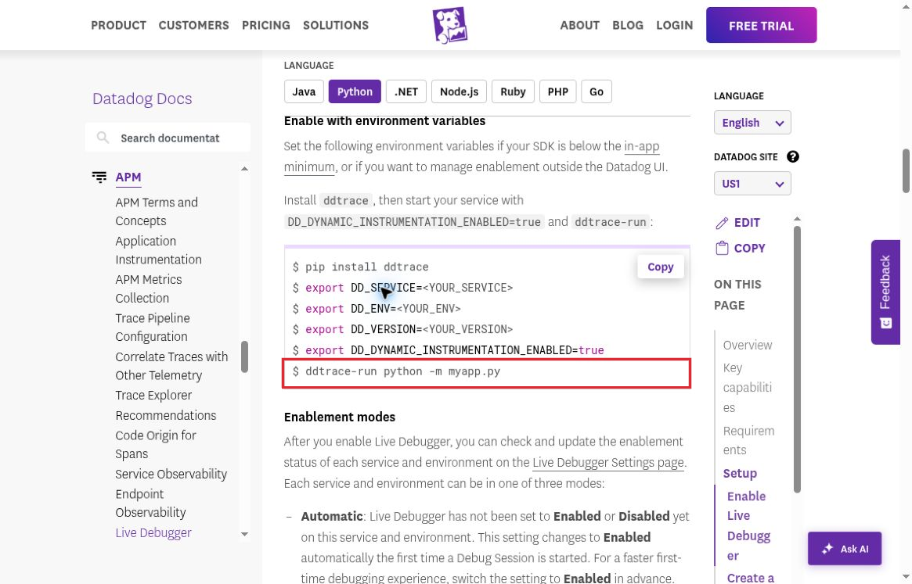

# DOC01 Python quickstart uses an invalid module command

MEDIUM · Confirmed documentation bug · Part 2 professional QA

[Severity-ranked index](../findings.md#severity-ranked-finding-index) · [High only](../high-severity.md) · [Annotated PDF](../report.pdf)

## Screenshot evidence

[Open full-size annotated screenshot](../evidence/annotated/DOC01-python-launch-command.png) · [Open full-size original](../evidence/04-python-launch-command.jpg)

Captured 2026-10-08 at 02:20:19 UTC. Actual browser screenshot, 1165 × 747 pixels. The red border is the only pixel change; the original is retained separately.

**Video:** [80-second early onboarding excerpt](../early-onboarding-excerpt.mp4), 00:58–01:20. The clip shows the actual public documentation. The Python reproduction below is separate local evidence.

**Source:** [Live Debugger documentation](https://docs.datadoghq.com/tracing/live_debugger/), Python tab, Enable with environment variables.

## Reproduce

1. Open the Python instructions and find the final launch command: `ddtrace-run python -m myapp.py`.
2. Create `myapp.py` containing only `print("INERT_FIXTURE_EXECUTED")`.
3. With Python 3.12.14, run `python -m myapp.py` and record the exit status.
4. Compare `python myapp.py` and `python -m myapp` as positive controls.

**Expected:** A valid script or module command launches the intended application without a module-resolution error.

**Actual:** The documented Python portion prints the fixture marker and exits 1 with a module-specification error. Python explicitly suggests the module name `myapp` instead of `myapp.py`. Both positive controls print the marker and exit 0. Independently reproduced at 02:31:35 UTC.

**Important nuance:** The bad invocation imports the module before failing, so top-level code may execute first. This does not establish the termination behavior of a long-running service. The check did not run the Datadog wrapper, Agent, or telemetry pipeline.

## Impact and correction

A beginner can copy the onboarding example and encounter Python module troubleshooting before reaching debugger setup. Severity is MEDIUM because it materially disrupts the quickstart but has a simple workaround.

Use `ddtrace-run python myapp.py` for a script, or `ddtrace-run python -m myapp` for a module. Add a quickstart smoke test that verifies successful process startup, followed by a real first-capture check.

**Retest boundary:** The syntax alternatives passed locally. The later hosted runtime launched with the supported script form and produced actual numeric captures, providing a live workaround control. This does not claim that the published documentation was corrected or that every quickstart step was retested. [Verified capture baseline](../EVIDENCE.md#verified-numeric-baseline).
