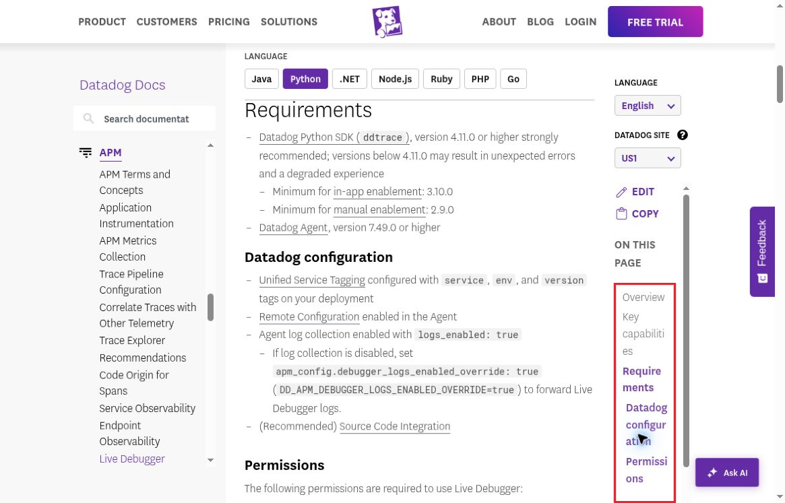

# DOC02 Contents rail splits section names mid-word

LOW · Confirmed layout bug · Part 1 new-user usability

[Severity-ranked index](../findings.md#severity-ranked-finding-index) · [High only](../high-severity.md) · [Annotated PDF](../report.pdf)

## Screenshot evidence

[Open full-size annotated screenshot](../evidence/annotated/DOC02-documentation-navigation.png) · [Open full-size original](../evidence/03-python-requirements.jpg)

Captured 2026-10-08 at 02:19:51 UTC. Actual browser screenshot, 1165 × 747 pixels. The red border is the only pixel change; the original is retained separately. The same behavior is also visible in DOC01's screenshot at a different scroll position.

**Video:** [80-second early onboarding excerpt](../early-onboarding-excerpt.mp4), 00:34–00:58.

**Source:** [Live Debugger documentation](https://docs.datadoghq.com/tracing/live_debugger/), Python tab.

## Reproduce

1. Open the Python documentation at approximately 1180 × 757 browser page viewport, with default zoom.
2. Scroll to Requirements.
3. Inspect the right-hand On this page navigation; compare another scroll position.

**Expected:** Section labels stay readable through word-boundary wrapping or a usable collapsed navigation pattern.

**Actual:** Requirements, Permissions, Datadog configuration, and other labels split in the middle of words.

## Impact and correction

The page outline becomes harder to scan while a beginner is assembling several prerequisites. Severity is LOW: readability is degraded, but no failed task completion was demonstrated from this issue alone.

Reserve enough rail width or collapse it at an earlier responsive breakpoint. Retest ordinary desktop widths, 125–150% zoom, and long translated labels.

**Coverage boundary:** The screenshots establish behavior at the captured desktop width. The additional zoom, language, and width combinations are planned tests, not verified failures.
