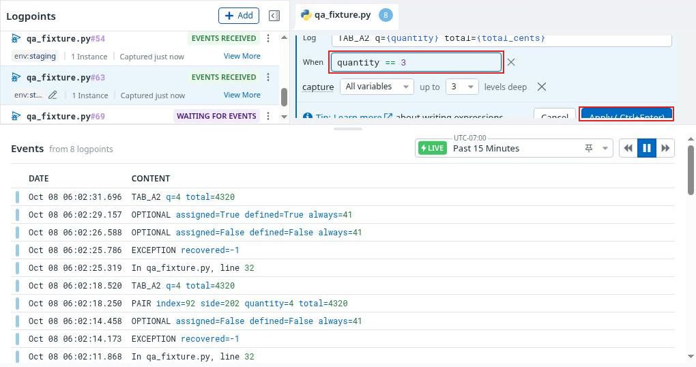
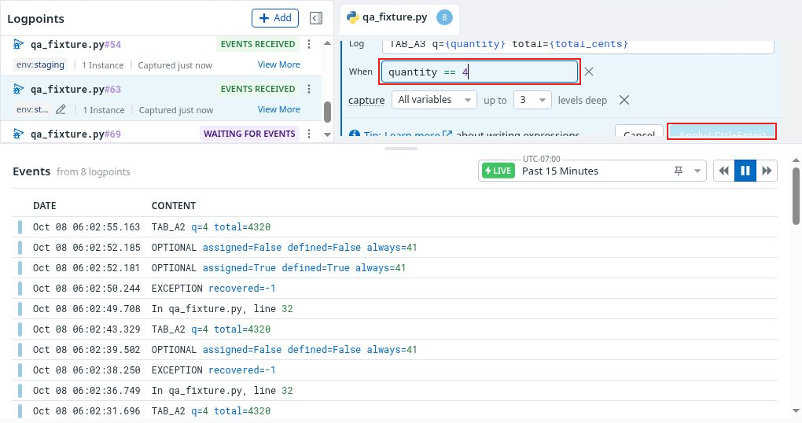

# FUNC01 · Saving in another tab discards an unsaved condition

**Severity: Medium · Part 2: detailed functional QA · Case: F09 · Confirmed in two reproductions**

## Why it matters

A message-only save in one tab erased an unsaved condition in another tab without a warning. The second editor visibly reverted to the stored condition and was no longer dirty. A user can lose their intended predicate without choosing to discard it.

The stored condition remained correct. This finding concerns lost unsaved work; it does not establish a conflicting saved-write failure, mixed active revision, or corrupted capture.

## Tested context

- Datadog Live Debugger's preview IDE-like experience, UI build **35.143306223**, read from the original capture footer. The public evidence crops focus on the editor; provenance retains the version observation.
- Two tabs editing the same existing `qa_fixture.py` line 63 logpoint in the same session.
- Saved predicate: `quantity == 4`; current saved message initially began `TAB_A2`.
- First reproduction: **8 October 2026, 13:01:13–13:01:59 UTC**. Repeated clean before/after sequence: **13:02:26–13:03:02 UTC**.

## Reproduce

1. Open the same logpoint editor in tabs A and B, with the saved condition `quantity == 4`.
2. In B, change the condition to `quantity == 3` without saving. Confirm that the editor is dirty and Apply is enabled.
3. In A, change only the log-message prefix from `TAB_A2` to `TAB_A3` and apply it.
4. Return to B without applying or discarding its draft.

**Expected:** Preserve the unsaved local condition, or explicitly explain the remote change and let the user reconcile or discard the draft.

**Observed:** B's rendered condition changed from `quantity == 3` to `quantity == 4`; its message updated to `TAB_A3`, and Apply became disabled. No warning or conflict explanation was observed. The same silent reset occurred twice. The saved condition remained `quantity == 4`.

## Genuine before/after evidence

### Before the other tab's save

[Full-size annotated before](../evidence/continuation-13/two-tab-132-135/134-unsaved-predicate-before-remote-save-outlined.png) · [Full-size sanitized original before](../evidence/continuation-13/two-tab-132-135/134-unsaved-predicate-before-remote-save-safe.png)

### After the other tab's message-only save

[Full-size annotated after](../evidence/continuation-13/two-tab-132-135/135-unsaved-predicate-overwritten-by-remote-save-outlined.png) · [Full-size sanitized original after](../evidence/continuation-13/two-tab-132-135/135-unsaved-predicate-overwritten-by-remote-save-safe.png)

**Evidence limits:** Apply is partly clipped by the event-pane divider in both originals. The screenshots preserve its visible styling; disabled-state confirmation and the intervening save action come from the recorder’s interaction chronology and rendered-editor observations. An accessibility snapshot briefly retained a stale value of 3 after the visible editor had changed to 4; this finding uses the rendered pixels and editor text, not that stale accessibility value. The absence of a warning was observed during the interaction, rather than inferred solely from one still.

The source recording is source 13, starting at 11:18:29 UTC. The two intervals correspond to source offsets **01:42:44–01:43:30** and **01:43:57–01:44:33**. The recording was still in progress when those intervals were identified. Its [reviewed archive](../recordings/continuation-13/CONTINUATION_RECORDING_ARCHIVE.md) and [highlight chapters](../recordings/continuation-13/highlights/CONTINUATION_HIGHLIGHTS.md) are now available. Their limited foreground sequence is described below; the missing editor-overwrite transition is not reconstructed.

## Suggested improvement

Preserve dirty fields when applying remote updates. If reconciliation is necessary, show which field changed elsewhere and offer an explicit keep/reload choice before discarding local input. Keep Apply state consistent with the user's surviving draft.

## Remaining F09 scope

A conflicting saved write, a stale-tab save of a different field, both-tab reload and new-capture revision checks still require their own evidence. This finding is sufficient to record F09 as FINDING for the observed dirty-draft branch; it does not mark every planned concurrency variant executed.

## Foreground motion review update

Source 13 foreground review shows the dirty quantity-three draft followed by a source/INSTRUMENTING view, rather than the exact quantity-four editor after-state in still 135. The movie will not be presented as a complete visible dirty-draft overwrite sequence. The reviewed before/after stills and rendered-editor chronology establish FUNC01; missing foreground steps are not reconstructed.
