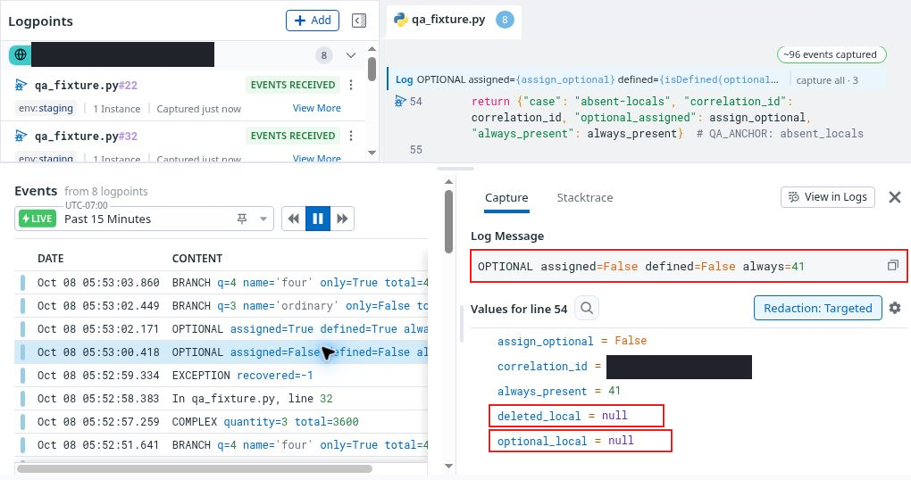

# FUNC02 · Unbound and deleted Python locals serialize as null

**Severity: Medium · Part 2: detailed functional QA · Confirmed SDK defect in ddtrace 4.11.0**

Live UI observations occurred before the **13:15 UTC live-QA cutoff** on 8 October 2026. The independent package reproduction was finalized just after that cutoff and confirmed at **13:16 UTC**. It is a separately dated verification addendum, not an additional executed original case.

## Why it matters

A local variable that has never been assigned, or has been deleted, is different from a variable explicitly assigned Python `None`. The tested SDK turns those absent compiled locals into `None` during collection and serializes them with the same null representation. A debugger user can consequently mistake an unexecuted or failed assignment for a real null value.

The actual installed-package controls establish the serialization defect. Three live UI contexts show the corresponding absent-versus-null discrepancy. **The hosted transport payload was not inspected**, so this report does not claim a UI-only cause or a completed attribution of the hosted transport path.

## Expected and actual

**Expected:** Distinguish an absent, unbound or deleted local from an explicitly assigned `None`, by omitting it or presenting a clear unavailable/unbound state.

**Actual package result:** Both unbound and deleted names are absent from `frame.f_locals`, and `isDefined` evaluates false. Nevertheless, the SDK collection and capture helpers output `{"type":"NoneType","isNull":true}`, identical to the output for an explicitly assigned `None`, where `isDefined` is true.

| Control | Present in Python locals | isDefined | SDK serialization |
|---|---|---|---|
| Assigned 42 | Yes | True | int, value 42 |
| Explicit None | Yes | True | NoneType, isNull true |
| Unbound branch local | No | False | NoneType, isNull true |
| Deleted local | No | False | NoneType, isNull true |
| Same branch later assigned 99 | Yes | True | int, value 99 |

All assertions in the offline reproduction passed. Numeric assigned controls remained correct.

## Live corroboration and positive controls

- A caught exception showed `quotient = null` after its assignment failed.
- An optional-local capture rendered `assigned=False` and `defined=False`, while its values panel displayed both the unassigned local and the explicitly deleted local as null. The assigned branch correctly showed 42.
- A quantity-three branch capture had `isDefined=False` and a null display for its branch-only local. Quantity four correctly showed `branch_only = 404`, `branch_name = four` and total 4320.

These are distinct from the earlier F05 nonexistent-expression control, which correctly produced an evaluation error and a false definedness result, and from F21's explicit name-based redaction explanation.

[Full-size annotated evidence](../evidence/continuation-13/locals-126-131/annotation/127-unassigned-deleted-locals-display-outlined.png) · [Full-size sanitized original](../evidence/continuation-13/locals-126-131/127-unassigned-deleted-locals-display-safe.png) · [Assigned-42 positive control](../evidence/continuation-13/locals-126-131/128-assigned-local-positive-control-safe.png) · [Branch-404 positive control](../evidence/continuation-13/locals-126-131/131-branch-assigned-display-control-safe.png)

Source 13 contains the live test period; its privacy-reviewed motion export and final chapter map are pending. The screenshot claims are limited to visible states. They are not a substitute for an inspected hosted capture blob.

## Reproduce offline

Tested with **Python 3.13.5 and the actual installed ddtrace 4.11.0 package**, using its `get_locals`, `capture_pairs` and expression helpers. The local Python patch version does not establish the hosted runtime's exact patch version.

The [reproduction script](../evidence/sdk-locals-4.11.0/reproduce.py), [result](../evidence/sdk-locals-4.11.0/result.json), [source provenance](../evidence/sdk-locals-4.11.0/source-provenance.json) and [portable command](../evidence/sdk-locals-4.11.0/run-offline.sh) are included. In an existing environment containing ddtrace 4.11.0, run `bash run-offline.sh <python-interpreter>`.

The command uses an empty environment plus explicit false flags for tracing, telemetry, remote configuration, dynamic instrumentation, symbol upload, profiling, AppSec, IAST and LLM Observability. An audit guard installed before SDK imports blocks Python socket operations except local hostname lookup, and blocks subprocess/OS command execution. The actual run reported zero blocked attempts. The portable command preserves the executed environment switches and replaces only execution-host paths with an interpreter argument and adjacent script path.

## Exact source and integrity

The installed helpers matched the official version-tagged source byte-for-byte:

- [`get_locals`, ddtrace 4.11.0](https://github.com/DataDog/dd-trace-py/blob/v4.11.0/ddtrace/debugging/_safety.py#L34-L45) enumerates compiled local names and obtains each through the frame-locals lookup. An absent name receives the lookup's default `None`.
- [Null capture handling, ddtrace 4.11.0](https://github.com/DataDog/dd-trace-py/blob/v4.11.0/ddtrace/debugging/_signal/utils.py#L217-L220) gives `None` its null representation.

| Measured helper | SHA-256 |
|---|---|
| _safety.py | b143433011976416337413e53be18921be0a8c625c8339b1aa3604b5b00ec4ff |
| _signal/utils.py | a952f392c6b4dd1e1484622941cef12ab4a485024cf873a1b789d7e801f51cb6 |

These are hashes of the two measured helper files. No distribution-wide or wheel hash was recorded.

## Suggested improvement and scope

Preserve the distinction between a missing local and an explicit `None` before serialization, for example by skipping absent frame-local keys or emitting a distinct unavailable marker. Keep the values view and definedness evaluation semantically consistent.

This finding is limited to the tested Python package/version and controls. It does not establish the behavior of every language, tracer version, future release, or hosted transport component. A hosted-payload comparison remains a useful attribution follow-up, rather than a prerequisite for the independently reproduced SDK result.
