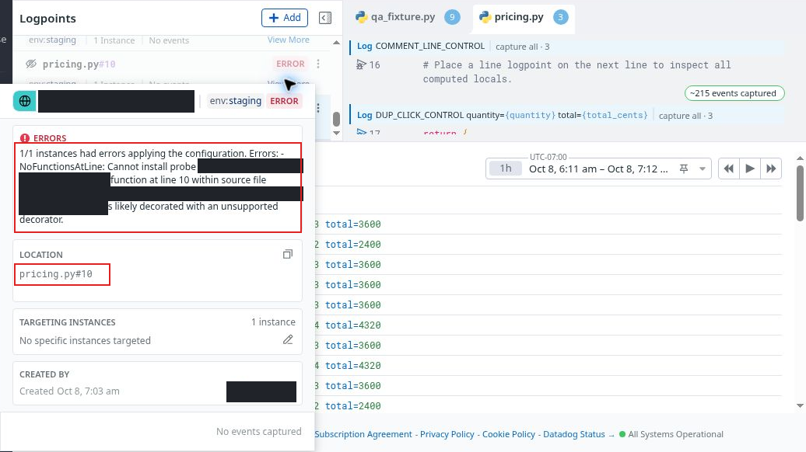

# FUNC03 · Blank-line rejection suggests an unsupported decorator

**Severity: Low · Part 2: detailed functional QA · Case: F06 · Confirmed diagnostic issue**

## Why it matters

A logpoint on a blank line was correctly rejected, but its error directed the user toward an unsupported decorator. The tested function has no decorators and captures correctly at an executable line. The misleading explanation can send a user to investigate or change the wrong code.

This finding concerns diagnostic specificity. It does not assert that blank lines must be instrumentable, that a rejected probe captured at another location, or that the valid captured values were wrong.

## Tested setup and sequence

- Synthetic `pricing.py`, unchanged source SHA-256 **3414cf40e6c1a4cca691ec4fe9c9657c74edede5dcb66e907c9aaa09ddf17ed4**.
- `calculate_quote` is a plain function defined at line 4. Line 10 is blank; line 16 is a comment; line 17 is an executable return.
- The control-phase runtime used ddtrace 4.11.0 and application version 0.3.0. The exact hosted Python patch is not established by the separate local verification.
- The line-10 diagnostic was inspected at **8 October 2026, 14:14:20 UTC**.

1. Create a line logpoint for `pricing.py:10` and allow its runtime installation status to settle.
2. Open the resulting ERROR details.
3. Compare with a line-17 probe in the same loaded function and current runtime epoch.

**Expected:** Explain that no executable target exists at the chosen line, or otherwise give a diagnostic grounded in the observed cause. If decorator handling is only one possible explanation, do not present it as the likely explanation for an ordinary blank line.

**Observed:** The line-10 probe showed ERROR and `NoFunctionsAtLine`, with the specific hint “likely decorated with an unsupported decorator.” The source has zero decorators. The valid line-17 control received real quantity-four values: subtotal 4800, discount 480, total 4320, true eligibility and unit price 1200.

## Genuine diagnostic and recovery evidence

[Full-size annotated error](../evidence/control-phase-155-167/annotation/163-line-10-unsupported-decorator-hint-outlined.png) · [Full-size sanitized original](../evidence/control-phase-155-167/163-line-10-unsupported-decorator-hint-safe.png) · [Valid line-17 capture](../evidence/control-phase-155-167/156-valid-line-17-recovery-capture-safe.png)

The error still shows the chosen line and exact hint. The absence of decorators and executable-line facts are established by the separately checked source, not by pretending the still displays the whole function. The line-17 still directly shows the captured positive-control values. Reviewed motion and its final chapter references remain a separate deliverable; this page does not invent a complete video sequence.

## Independent source check

The [local source verification](../evidence/blank-line-diagnostic/source-verification.json), performed with Python 3.13.5, records:

- zero AST decorators on `calculate_quote`;
- line 10 as a newline, with no executable bytecode line;
- line 16 likewise non-executable;
- line 17 executable and the quantity-four result correct.

The installed ddtrace 4.11.0 `_debugger.py` matches the [official version-tagged source](https://github.com/DataDog/dd-trace-py/blob/v4.11.0/ddtrace/debugging/_debugger.py#L378-L393) byte-for-byte. The relevant branch emits this decorator hint when function discovery finds no target but a physical source-line lookup returns a truthy value. A blank newline is truthy, so this test does not distinguish a blank line from a decorator problem.

[SDK source provenance](../evidence/blank-line-diagnostic/sdk-source-provenance.json): 27,457 bytes, SHA-256 **ea5a69b4a727ae5565e6ce402473a48c7cbbfd03b412cadd6704aa76f7908cb9**. This is a measured file hash, not a distribution-wide checksum. The upstream retrieval succeeded after an earlier web-cache miss.

## Suggested improvement and limits

Distinguish an out-of-range or non-executable line from evidence of an unsupported wrapper. A direct instruction to choose an executable statement would fit this reproduction and its verified line-17 recovery.

The separate line-16 generic suggestion to check whether code is loaded is retained as an observation, not a second confirmed defect. The finding is scoped to the observed blank-line diagnostic in the tested package/setup. The rejection itself is appropriate, and no silent relocation or capture corruption was demonstrated.
