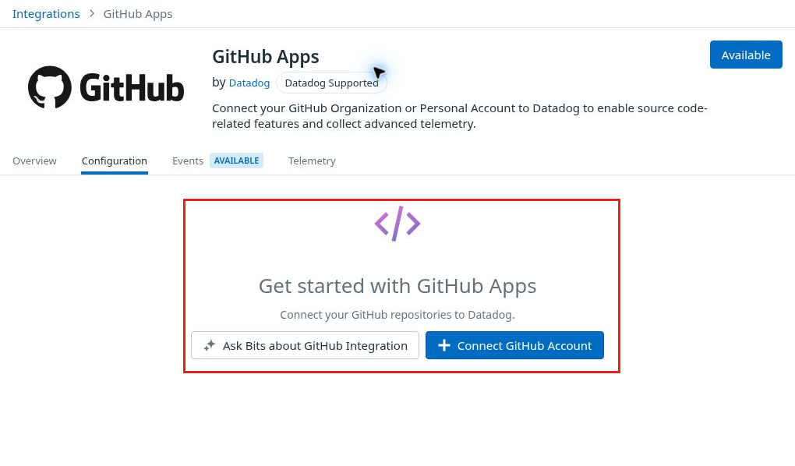
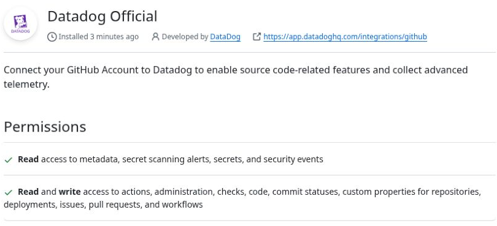
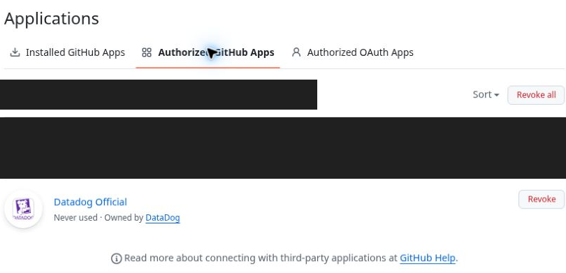
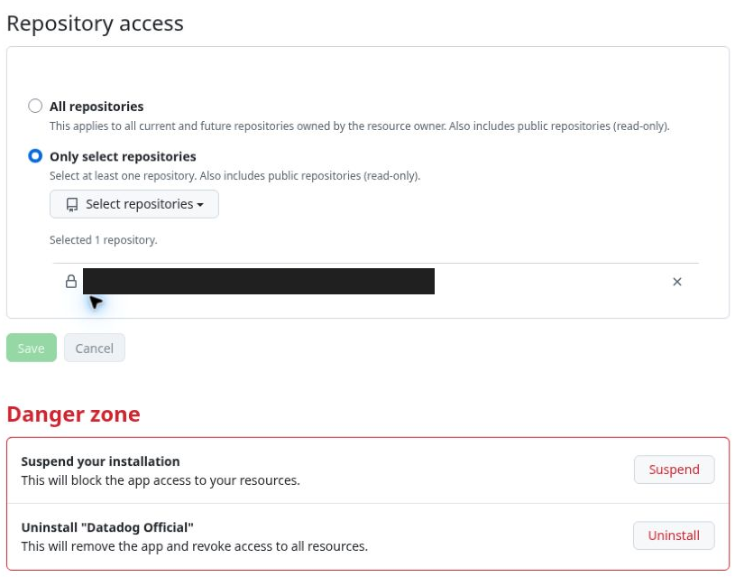

# SCI01 Interrupted GitHub connection does not recover through Connect

MEDIUM · Scoped functional recovery issue · Part 2 professional QA · Case S11

V8 update: the historical interrupted-flow failure remains recorded. An approved same-A-only uninstall/reinstall at 09:49–09:55 repaired association, followed by successful exact source verification.

[Severity index](../findings.md#severity-ranked-finding-index) · [High only](../high-severity.md) · [PDF](../report.pdf)

## Annotated screenshot

[Full-size annotated image](../evidence/30-github-return-empty-integration-public-annotated.png) · [Full-size sanitized original](../evidence/30-github-return-empty-integration-public.png). Captured 04:50:15 UTC. The personalized top bar/navigation is cropped out; the separate annotated version adds only the disclosed red outline.

## Corroborating states

[Full-size installed-app state](../evidence/32-github-installed-a-only-public.png), 04:51:29 UTC. This image verifies installation only; repository scope is below.

[Full-size user-authorization state](../evidence/37-github-authorized-apps-public.png), 04:56:26 UTC. Unrelated application/account areas are masked. Never used is the observed label, not a diagnosis.

[Full-size saved scope](../evidence/38-a-only-after-b-created-public.png), 05:06:05 UTC. The private identity is masked; private test observation verifies that the selected repository is A, and B remains ungranted.

## Preconditions and reproduction

1. Start the official GitHub connection from the intended Datadog organization with a personal GitHub test account.
2. Leave the installation form open approximately 75 minutes before granting the explicitly approved A-only installation. Complete required reauthentication.
3. On return, select the intended Datadog organization. Observe Get Started / Connect GitHub Account without a success or error confirmation.
4. Use Connect again. GitHub opens the existing installation settings; the unchanged settings have Save disabled and no usable completion route.
5. Navigate fresh through Integrations → GitHub → official GitHub Apps. Verify the intended Datadog organization and site. The page still offers the unconnected flow. Cancel any selection draft and reload; persisted scope remains A-only.

The delay is a reproduction precondition, not an established cause. No claim is made that a fresh uninterrupted install fails. No callback URL was replayed. No app was revoked or uninstalled during this original reproduction; the separately approved repair is recorded below.

## Expected and actual

Expected: the documented Install & Authorize flow returns a Datadog connection confirmation. If interrupted, an offered recovery route should complete association or identify the remaining step/error. [Official Datadog flow](https://docs.datadoghq.com/integrations/github/).

Historical actual: GitHub installation and user authorization were present, but Datadog remained unconnected. The visible Connect retry returns to unchanged installed-app settings and does not restore association. Fresh catalog navigation in the verified account context gives the same state.

Impact: source linking cannot be completed through the offered route in this interrupted state. Manual debugger entry remains available. The original Connect retry did not restore source association. A later approved same-scope uninstall/reinstall did, as documented below. Severity is Medium for this bounded recovery failure; broader fresh-install behavior and the backend cause remain unproven.

Suggested recovery: detect or explain partial association, offer a supported same-scope resume, and preserve the selected Datadog organization. Confirm success or give a specific actionable error rather than repeating the initial Connect route.

## Verified same-scope recovery

A fresh catalog retry preserved the original failure. The approved repair removed the old A-only installation around 09:49, completed fresh A-only authorization around 09:54 and reached connected Datadog configuration around 09:55. B remained ungranted throughout. [Connected configuration screenshot](../evidence/continuation-11/71-source-integration-installed-safe.png).

This is a verified reinstall workaround and fresh-install positive control. It does not establish the root cause, prove that the earlier approximately 75-minute pause caused the failure, or show that ordinary Connect retries now repair that interrupted state. A supported same-scope resume would avoid this recovery burden.

Actual source retrieval was checked separately: at 10:25:48 the provider link followed from Datadog matched repository A, deployed SHA `f5061500e8bf30880aebcf7966ba64df44d2ccde`, `pricing.py:17` and all 24 file lines. [Exact source evidence](../EVIDENCE.md#verified-deployed-source). This does not test the B-never-granted private-content boundary or other revisions.

Source 11 motion stops at 09:53:41.25 before final authorization/callback. Its [reviewed highlights](../recordings/continuation-11/highlights/CONTINUATION_HIGHLIGHTS.md) show the reset and selected-repository draft; the approximately 09:54–09:55 completion is screenshot-only.

## Evidence boundaries

Installation before 04:49:33 is screenshot-only. Subsequent recovery has reviewed genuine motion: [highlight 00:00–00:10.50 and 01:19.50–01:31.50](../recordings/continuation-07/highlights/approved-setup-continuation-highlights.mp4). [Full retained sections and omissions](../recordings/continuation-07/CONTINUATION_RECORDING_ARCHIVE.md) preserve wider context. Raw recordings remain private. The earlier published videos do not show the completed installation. [Exact screenshot provenance](../evidence/runtime-privacy-provenance.md) · [Current video catalog](../VIDEOS.md).

The original failure evidence does not itself prove source retrieval or runtime capture. The later capture and exact source comparison are reported separately; no permissions leak or wrong deployed revision is established. GitHub distinguishes installation from user authorization; both lists were checked here. [GitHub authorization model](https://docs.github.com/en/apps/using-github-apps/authorizing-github-apps).
