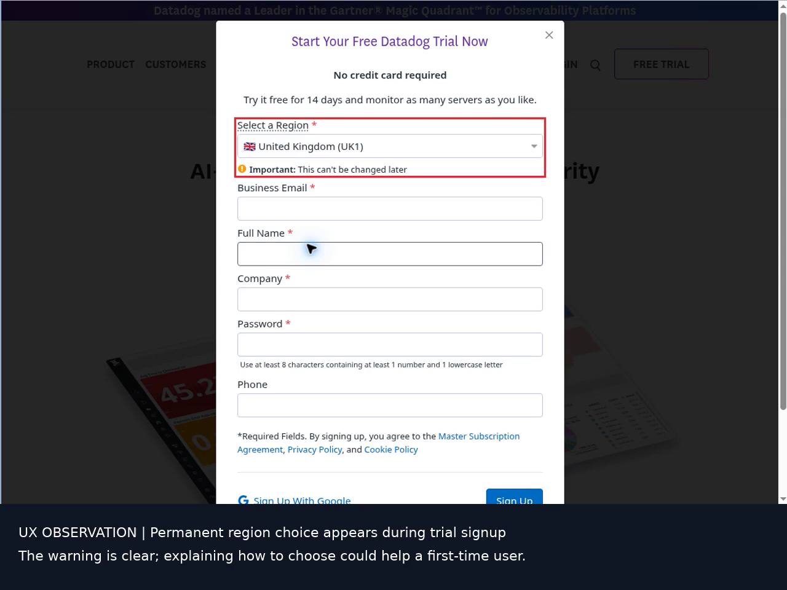

# UX01 Permanent region choice needs decision support

LOW · UX recommendation · Part 1 new-user usability

[Severity-ranked index](../findings.md#severity-ranked-finding-index) · [High only](../high-severity.md) · [Annotated PDF](../report.pdf)

## Screenshot evidence

[Open full-size annotated screenshot](../evidence/annotated/UX01-region-choice.png) · [Open full-size original frame](../evidence/08-public-signup-blank-video-frame.png)

Actual frame at 00:20 in the edited excerpt, sourced from raw capture 00:50, approximately 2026-10-08 02:15:17 UTC. All identity fields are blank. The red border is the only pixel change to this extracted frame. The caption band was already part of the edited video.

**Video:** [80-second early onboarding excerpt](../early-onboarding-excerpt.mp4), 00:20–00:34.

## Observed experience

1. Start a fresh Datadog trial.
2. Inspect Select a Region before submitting the form.
3. Consider how a person unfamiliar with Datadog would choose when told the choice cannot change later.

The form clearly warns that the region cannot be changed later. That warning is useful. The captured form offers little in-place decision support about what should drive the choice.

## Recommended experience

Explain account-location implications briefly, or link to a region chooser before submission. Preserve the existing explicit permanent-choice warning.

**Impact:** Additional guidance could reduce guessing at an irreversible first step. Severity is LOW because this is a localized decision-support recommendation.

**Classification boundary:** This is not a confirmed functional failure. No wrong-region account, data loss, or failed submission was demonstrated. The default shown in this test session does not establish the user's geography.
