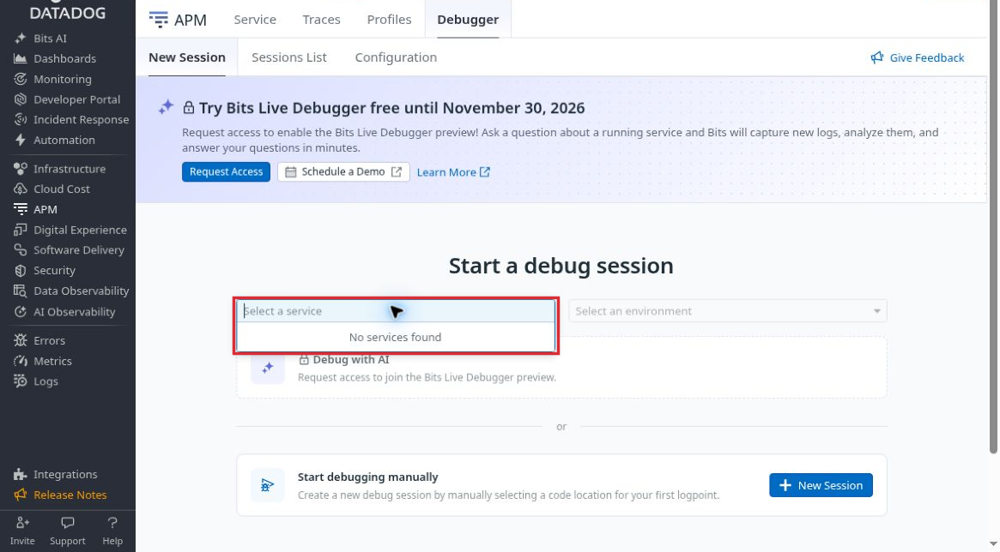
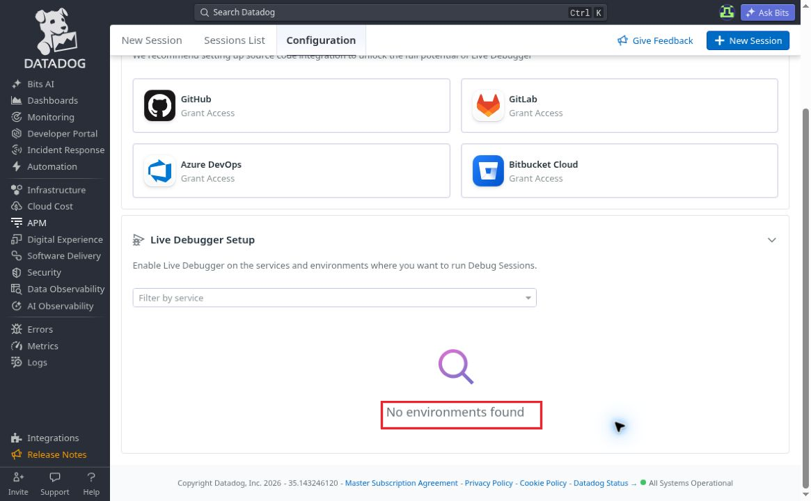

# UX02 Empty service states do not explain setup recovery

LOW · UX recommendation · Part 1 new-user usability

[Severity-ranked index](../findings.md#severity-ranked-finding-index) · [High only](../high-severity.md) · [Beginner glossary](../glossary.md)

## Screenshot evidence

[Open full-size annotated screenshot](../evidence/annotated/UX02-empty-service-list.png) · [Open full-size evidence crop](../evidence/10-live-debugger-service-list-public.png)

Captured 2026-10-08 at 03:21:54 UTC. The top 76 pixels containing the account greeting were removed for public sharing. The remaining UI pixels are unchanged except for the separately added red border.

[Open full-size annotated screenshot](../evidence/annotated/UX02-no-environments.png) · [Open full-size original](../evidence/13-live-debugger-no-environments.jpg)

Captured 2026-10-08 at 03:23:59 UTC. This scrolled screenshot contains no account identifier. The red border is the only pixel change.

**Video evidence:** The authenticated source recording exists; its privacy-reviewed public excerpt is pending. Approximate source interval is 01:00–03:40 from a recording started at 03:20:17 UTC. No unreviewed raw recording is linked.

## Reproduce

1. In the fresh test organization, open APM → Debugger → New Session while no services are available.
2. Open the service picker: it reports “No services found.”
3. Click the visible New Session action in the manual-debugging section. The modal opens, but the same unavailable service is required; Start Debug Session is disabled.
4. Close the modal, then open Configuration and inspect Live Debugger Setup. It instructs the user to enable services/environments, but reports “No environments found.”

## Observed experience

The unavailable selections are clear, but neither captured empty-state message identifies a concrete setup recovery step. The Configuration setup section has no direct Agent/APM recovery link beside its empty state. A complete newcomer must infer which prerequisite is missing and where to fix it.

The separate Source Code Integrations section is described as recommended and offers provider Grant Access actions. Those actions do not explain how to make an absent runtime service or environment appear.

## Recommended experience

Add a contextual “Connect your first service” or prerequisite-check action beside the empty state. Explain which checks are known and unknown, including application instrumentation/APM, environment tagging, compatible SDK/Agent, Remote Configuration, and permissions. Avoid attributing a specific cause when the product has not established it.

**Severity:** LOW. This is recovery/discoverability friction. The test has not established that a correctly configured service is incorrectly absent.

## Positive behavior and boundaries

- Manual debugging remains visible without Source Code Integration. Source linking did not falsely block entry to the manual route.
- Start Debug Session is correctly disabled when no service is selected.
- Closing the modal returns to the prior page; no session was created in this check.
- Runtime connectivity and Remote Configuration were being investigated separately. Their state is not itself a Datadog product defect.
- This finding is limited to the captured empty-state section and modal. It does not claim that no onboarding help exists elsewhere in Datadog.
