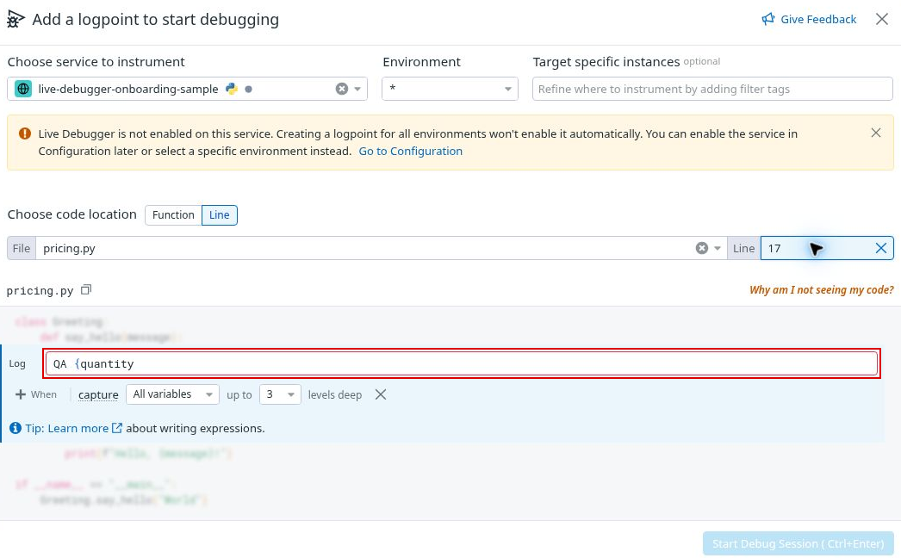

# UX03 Invalid log template lacks an explanatory error message

LOW · Scoped UX and accessibility feedback issue · Part 1 beginner usability · Case B09

[Severity index](../findings.md#severity-ranked-finding-index) · [High only](../high-severity.md) · [PDF](../report.pdf)

## Annotated screenshot

[Full-size annotated screenshot](../evidence/continuation-10/annotation/ux03-invalid-log-template-lacks-explanatory-error-message.png) · [Full-size sanitized original](../evidence/continuation-10/58-invalid-template-draft.png) · [Valid correction control](../evidence/continuation-10/59-corrected-template-draft.png).

Observed during 06:25–06:28 UTC. Source file 58 timestamp is 06:26:32 UTC; filesystem times are provenance, not independent event clocks. The annotation adds only a separate thin outline and preserves the genuine validation border. [Crop and source provenance](../evidence/continuation-10/README.md) · [Annotation geometry](../evidence/continuation-10/annotation/annotation-manifest.json).

## Reproduce in the tested draft state

1. Open a manual Line logpoint draft for the synthetic service, wildcard environment, pricing.py line 17. Keep the visible service-not-enabled warning unchanged.
2. Enter an unmatched template such as QA {quantity. Start Debug Session is disabled.
3. Move focus away. The editor gains a red border, but the captured view and recorded accessibility snapshot show no text explaining the template syntax error.
4. Add the closing brace. The red border disappears and Start becomes enabled. Do not submit.

## Expected and actual

Expected: detected input errors identify the affected field and explain what to correct in text. Appropriate programmatic association should let users find the same explanation.

Actual: validation does work visually and prevents submission. In this observed state it leaves the reason and correction implicit: a red border and disabled Start are present, while no syntax-error explanation was found in the captured view or recorded accessibility snapshot. The inspected textarea has the generic name “Editor content;Press Alt+F1 for Accessibility Options.” and no recorded aria-invalid, aria-describedby or aria-errormessage. The captured alert concerns service setup, not this template error. [Recorded DOM attributes](../evidence/continuation-10/field-accessibility-observation.json).

Impact: a novice must infer why Start stopped working and which edit will fix it. The generic editor name also gives limited field-purpose context. Severity is Low because the valid correction recovers the draft and no inability to recover with assistive technology was demonstrated.

## Guidance and recommended retest

W3C's error-identification guidance calls for text describing automatically detected input errors. It does not require one particular ARIA technique, and missing aria-invalid alone is not proof of a failure. [W3C SC 3.3.1 Error Identification](https://www.w3.org/WAI/WCAG22/Understanding/error-identification.html).

Add a persistent, specific message such as “Close the expression with }.” Associate it with the editor and expose invalid state through appropriate supported semantics. Give the editor a purpose-specific name including its visible Log label. Retest the full transition, blur/refocus, delayed feedback and live regions with a supported screen-reader/browser combination.

## Boundaries and positive controls

- The red border exists; validation is not visually absent. The disabled button is another cue, so this report does not assert a formal color-only failure.
- Correction reliably removes the border and enables the draft. No logpoint was submitted in this check.
- No screen-reader execution or full WCAG conformance audit was performed. A settled snapshot cannot exclude an earlier transient announcement.
- The JSON is an attribute/alert sample, not a complete accessibility-tree export.
- A separate Line-input naming concern remains a retest item. Missing recorded label attributes do not establish the computed accessible name; title, placeholder, native semantics and naming sources must also be checked. [HTML accessibility-name mappings](https://www.w3.org/TR/html-aam/#accessible-name-and-description-computation).

## Genuine motion

[Reviewed highlights](../recordings/continuation-10/highlights/draft-feedback-continuation-highlights.mp4): 00:29.30 unmatched template; 00:41.30 feedback after blur; 00:53.30 correction. [Exact chapters and UTC](../recordings/continuation-10/highlights/CONTINUATION_HIGHLIGHTS.md) · [Full retained recording and omissions](../recordings/continuation-10/CONTINUATION_RECORDING_ARCHIVE.md). The video shows visual behavior; programmatic observations come from the separate inspection.
