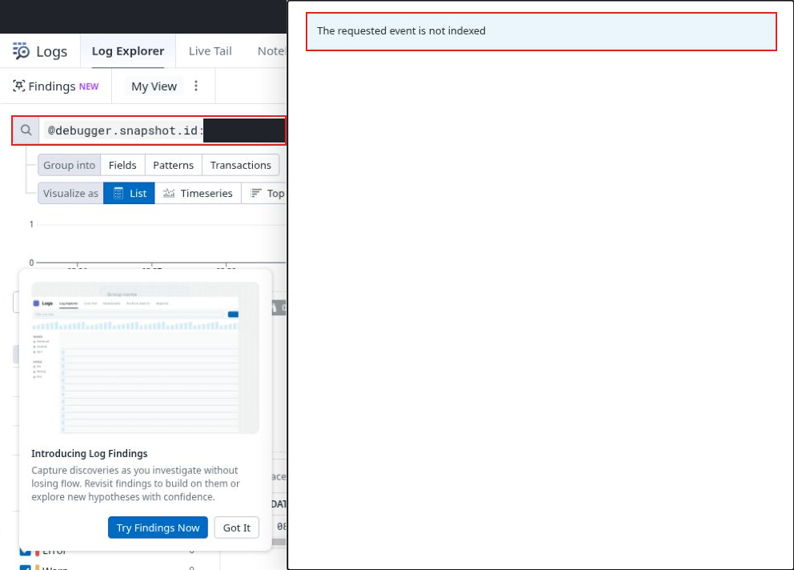

# UX04 View in Logs opens a not-indexed pane for a recoverable indexed snapshot

LOW · Scoped navigation recovery issue · Part 1 beginner usability · Case B08

V8 checkpoint: 2026-10-08 10:50:59 UTC.

[Severity index](../findings.md#severity-ranked-finding-index) · [High only](../high-severity.md) · [PDF](../report.pdf)

## Annotated screenshot

[Full-size annotation](../evidence/continuation-12/94-view-in-logs-not-indexed-outlined.png) · [Sanitized original](../evidence/continuation-12/94-view-in-logs-not-indexed-safe.png) · [Original-image provenance](../evidence/continuation-12/94-provenance.json) · [Annotation provenance](../evidence/continuation-12/94-annotation-provenance.json).

The annotation adds only disclosed thin red outlines to a genuine screenshot. **The matching row and count are obscured in this still.** They are not outlined or claimed to be visible. The exact snapshot-ID/probe/timestamp matches below were verified separately in the recovered indexed-row JSON.

## Preconditions and reproduction

1. Open an actual captured event in a Live Debugger session and retain its snapshot identity.
2. Choose View in Logs.
3. Observe the pane stating “The requested event is not indexed.”
4. Inspect the matching indexed result and click its row. The event details, values, source and JSON become available.
5. Compare the recovered `debugger.snapshot.id`, probe and SDK timestamp with the requested snapshot identity.

This occurred on two captured identities: the control visit around 10:25 and the target visit at 10:41:47. Both recovered rows matched the exact requested snapshot identity, probe and timestamp. This was more than a similar-message or similar-time comparison. The public screenshot masks identifying values; the bounded identity verification is recorded separately in the audit observations.

## Expected and actual

Expected: View in Logs opens the requested indexed snapshot's details. If the initial event lookup cannot be resolved, the interface should make the available matching result and recovery action clear.

Actual: the direct event route opened a not-indexed pane, although the exact snapshot was present as an indexed result. One row click recovered the details. Returning to the debugger preserved the tested snapshot/session context.

Impact and severity: Low navigation-recovery friction. The event is recoverable, so the evidence does not establish data loss, a universal indexing failure or an unusable session.

Suggested improvement: resolve the direct event route consistently to the exact indexed snapshot, or expose a clear path to its matching result when direct resolution fails.

## Positive control and boundaries

The recovered quantity-three snapshot and Datadog source explain the planted application bug: the condition `quantity > 3` leaves quantity 3 ineligible, discount 0 and total 3600. The provider-link/deployed-source comparison is a separate S02 pass.

No backend root cause or interpretation of internal navigation encodings is inferred. The count is not used as proof of identity. Event-list timestamps are not substituted for SDK execution timestamps. Screenshot 94 proves the visible error/query state only; row-click recovery and exact identities are separate rendered-UI/payload observations.

Source 12's foreground motion is partly obscured by a context menu. Its reviewed local [highlight chapter map](../recordings/continuation-12/highlights/CONTINUATION_HIGHLIGHTS.md) includes the visible error, but matching identity is established separately; the complete safe archive is publicly verified at `7cdd468`, and that highlight package at `9edb46e`. [Evidence catalog](../EVIDENCE.md#source-value-explanation) · [Current video limits](../VIDEOS.md#source-12-source-controls-and-expiry-after-state).
